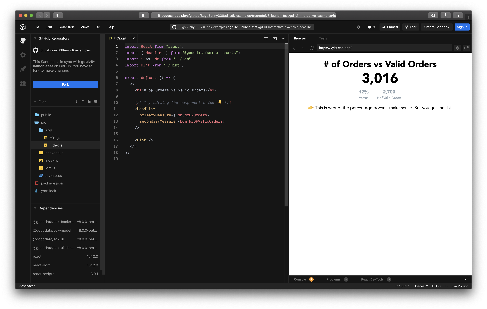

# GoodData.UI SDK - Interactive Examples

Here are basic examples of usage of [GoodData.UI](https://github.com/gooddata/gooddata-ui-sdk).

## List of Examples

* Headline - [open in CodeSandbox](https://codesandbox.io/s/github/gooddata/gooddata-ui-examples/tree/master/example-headline?file=/src/App/index.js)
* ComboChart - [open in CodeSandbox](https://codesandbox.io/s/github/gooddata/gooddata-ui-examples/tree/master/example-combochart?file=/src/App/index.js)
* RelativeDateFilter - [open in CodeSandbox](https://codesandbox.io/s/github/gooddata/gooddata-ui-examples/tree/master/example-relativedatefilter?file=/src/App/index.js)
* Treemap Config - open in CodeSandbox
* PivotTable - open in CodeSandbox
* InsightView - open in CodeSandbox
* Execute - open in CodeSandbox
* Year Filter - open in CodeSandbox
* AttributeFilter - open in CodeSandbox
* Custom Attribute Filter - open in CodeSandbox
* Granularity - open in CodeSandbox
* DateFilter - TODO

## Running Examples in CodeSandbox using GitHubBox

An easy way to open an example in [CodeSandbox](https://codesandbox.io/) via URL is with [GitHubBox.com](https://github.com/dferber90/githubbox). Append 'box' to the github.com URL in between 'hub' and '.com' and it will redirect to CodeSandbox. Here's an example:

Change the GitHub URL:\
https://github.com/gooddata/gooddata-ui-examples/tree/master/example-headline.

To:\
https://githubbox.com/gooddata/gooddata-ui-examples/tree/master/example-headline.

## Running Examples locally

You can also run any example on your localhost.

1. `git clone git@github.com:gooddata/gooddata-ui-examples.git`
1. `cd gooddata-ui-examples/example-headline`
1. `yarn install`
1. `yarn start`

## License

(C) 2017-2020 GoodData Corporation

This repository is under the GoodData commercial license available in the [LICENSE](LICENSE) file because it contains a commercial package, HighCharts. Subdirectories containing the MIT license are not subject to the GoodData commercial license and do not contain any commercial code.
